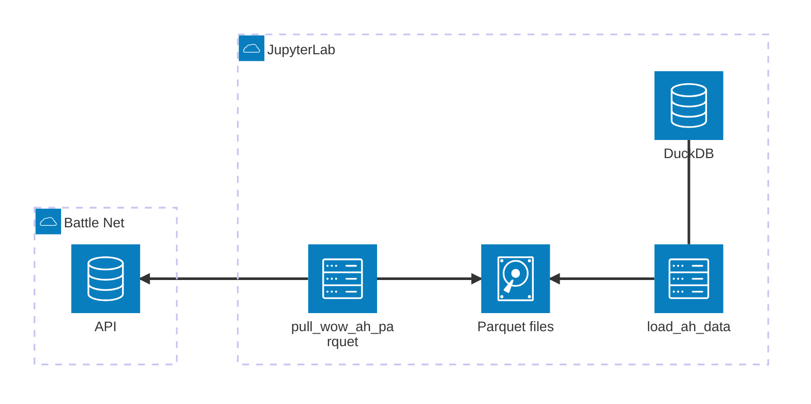
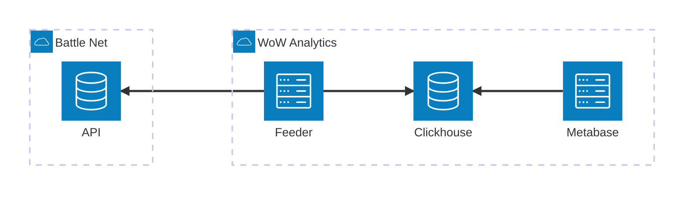

# wow-analytics

Proof of Concept regarding using Blizzard API, especially Auction House, to test analytics components.

## Architecture

### Proof of Concept

Based on [JupyterLab](https://jupyter.org/) notebooks in order to:

- store Blizzard AH data into [Apache Parquet](https://parquet.apache.org/) files
- load those Parquet files into [DuckDB](https://duckdb.org/) for data exploration



### Production target

For a larger scale deployment:

- Use a real-time analytics store such as [ClickHouse](https://clickhouse.com/)
- Visualize data from dashboards in [Metabase](https://www.metabase.com/)



## Requirements

In order to use this project you will need:

- Install [Mise](https://mise.jdx.dev/getting-started.html)
- Create an API Access from [Battle.net Developer portal](https://community.developer.battle.net/access/clients):
    - You will get a set of OAuth credentials: **Client ID** & **Client Secret**

## How to use

You can use the following commands to set up your local environment:

```shell
# Install required tools
mise install

# Set up Python environment
mise run setup

# Provide secret credentials
cat > .env << EOF
BLIZZARD_API_CLIENT_ID=YOUR_CLIENT_ID
BLIZZARD_API_CLIENT_SECRET=YOUR_CLIENT_SECRET
BLIZZARD_API_REGION=eu
EOF
```
